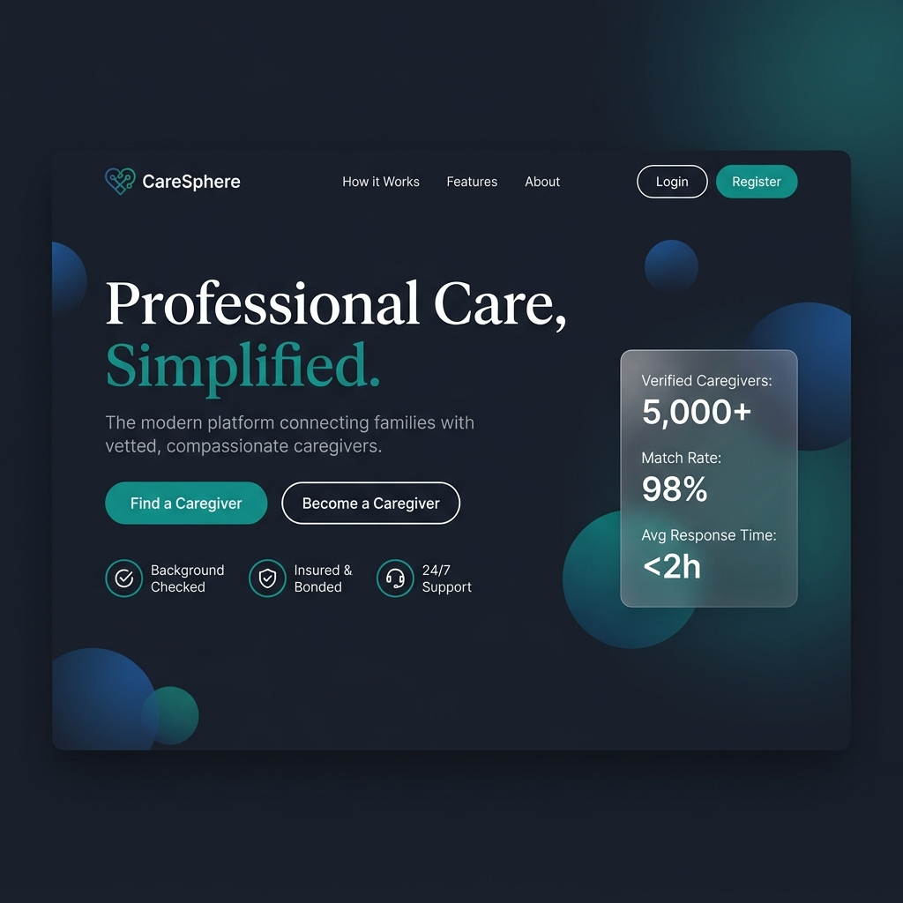

<p align="center">
  
</p>

<h1 align="center">🩺 CareSphere — Trusted Caregiving Marketplace Platform</h1>

<p align="center">
  <strong>A modern, full-stack web application connecting families with verified, compassionate caregivers through intelligent matching, real-time communication, and secure data management.</strong>
</p>

<p align="center">
  
  
  
  
  
  
  
  
</p>

<p align="center">
  <a href="#-introduction">Introduction</a> •
  <a href="#-literature-review">Literature Review</a> •
  <a href="#-methodology">Methodology</a> •
  <a href="#-investigation-and-analysis">Investigation & Analysis</a> •
  <a href="#-design">Design</a> •
  <a href="#-implementation">Implementation</a> •
  <a href="#-evaluation-of-product">Evaluation</a> •
  <a href="#-critical-evaluation-of-project">Critical Evaluation</a> •
  <a href="#-conclusion">Conclusion</a>
</p>

---

# 📘 Introduction

## 1.1 Project Overview

CareSphere is a comprehensive, production-grade caregiving marketplace platform designed to bridge the gap between families seeking professional care services and verified caregivers offering their expertise. The platform addresses a critical and growing need in the healthcare and social services sector: the difficulty families face in finding, vetting, and managing professional caregivers for their loved ones, whether they require elderly care, child care, special needs assistance, or other forms of personal care.

The application is architected as a modern monorepo containing two primary applications — a **Next.js 14 frontend** (React 18) and a **NestJS 11 backend API** — unified through a pnpm workspace with shared packages. The system leverages PostgreSQL 16 as its primary data store, managed through Prisma ORM, and implements real-time communication via Socket.IO WebSocket gateways for chat messaging, live notifications, video call signaling, and GPS location tracking.

CareSphere implements a role-based access control (RBAC) system with three primary user types: **Customers** (families seeking care), **Caregivers** (professionals providing care), and **Administrators** (platform managers). Each role has a distinct set of permissions, dashboards, and workflows tailored to their needs.

## 1.2 Problem Statement

The caregiving industry faces several systemic challenges that CareSphere aims to address:

1. **Trust Deficit**: Families often struggle to verify the credentials, background, and experience of potential caregivers. Without a reliable vetting mechanism, families are left to rely on word-of-mouth referrals or unverified online listings, which can lead to unsafe or inadequate care situations.

2. **Fragmented Communication**: Traditional caregiving arrangements rely on phone calls, text messages, and paper-based record keeping. This fragmentation leads to miscommunication, lost medical information, and a lack of accountability in the care delivery process.

3. **Inefficient Matching**: Finding the right caregiver involves considering numerous factors including specialisation, location, availability, language proficiency, hourly rates, and personality compatibility. Manual matching is time-consuming and often results in suboptimal pairings.

4. **Data Security Concerns**: Sensitive medical records, emergency contacts, and personal health information need to be shared between families and caregivers, but existing solutions lack proper encryption and access control mechanisms.

5. **Payment Transparency**: The absence of a standardised payment system leads to disputes over rates, hours worked, and service quality. Families need transparent invoicing, and caregivers need reliable income tracking.

6. **Administrative Overhead**: Managing a large pool of caregivers, verifying credentials, handling disputes, and monitoring platform health requires sophisticated administrative tooling that most existing solutions lack.

## 1.3 Project Objectives

The primary objectives of CareSphere are:

- **Develop a secure, scalable marketplace** that connects families with verified caregivers through an intuitive web interface
- **Implement an intelligent matching algorithm** that considers location proximity, skill compatibility, language preferences, and user ratings to recommend optimal caregiver-customer pairings
- **Build a real-time communication system** supporting instant messaging, typing indicators, read receipts, online presence detection, and WebRTC video calling
- **Create an encrypted Family Vault** using AES-256-GCM encryption for storing and selectively sharing sensitive medical records and care instructions
- **Integrate Stripe payment processing** for secure transactions, automated invoicing with PDF generation, and transparent earnings tracking
- **Establish a comprehensive admin dashboard** with analytics, user management, caregiver verification workflows, audit logging, and revenue reporting
- **Deploy using Docker containerisation** with separate containers for the API, frontend, PostgreSQL database, and Redis cache, enabling consistent deployment across environments

## 1.4 Scope and Limitations

The current scope of CareSphere encompasses the full lifecycle of a caregiving engagement: from user registration and caregiver discovery, through booking and real-time care coordination, to post-service review and payment processing. The platform supports web-based access through responsive design, with the frontend optimised for both desktop and mobile viewports.

Key limitations include the absence of a native mobile application (the platform is currently web-only), the reliance on Stripe for payment processing (limiting the platform to Stripe-supported regions), and the use of Puppeteer for PDF invoice generation (which introduces a heavyweight dependency). Additionally, the video calling feature utilises WebRTC signaling through Socket.IO but does not include a TURN server configuration for NAT traversal, which may limit its effectiveness in certain network environments.

## 1.5 Target Audience

CareSphere serves three distinct user groups:

- **Families and Individuals** who require professional caregiving services for elderly relatives, children, individuals with special needs, or other dependents requiring regular or occasional care
- **Professional Caregivers** who wish to offer their services through a trusted platform, manage their schedule and earnings, and build their professional reputation through verified reviews
- **Platform Administrators** who oversee the marketplace, verify caregiver credentials, manage user accounts, resolve disputes, and monitor platform analytics

## 1.6 Technologies Used

| Layer | Technology | Version | Purpose |
|:------|:-----------|:--------|:--------|
| Frontend Framework | Next.js | 14.2 | Server-side rendering, routing, React framework |
| UI Library | React | 18.x | Component-based user interface development |
| Styling | TailwindCSS | 3.4 | Utility-first CSS framework for responsive design |
| Animation | Framer Motion | 12.x | Declarative animations and transitions |
| Icons | Lucide React | 1.8 | Modern, customisable icon library |
| Charts | Recharts | 3.8 | Data visualisation for admin analytics |
| Maps | Leaflet + React Leaflet | 1.9 / 5.0 | Interactive maps for location-based features |
| Backend Framework | NestJS | 11.x | Modular, TypeScript-first Node.js framework |
| ORM | Prisma | 7.7 | Type-safe database access and migrations |
| Database | PostgreSQL | 16 | Relational data storage with advanced indexing |
| Cache | Redis | 7.x | Session management and rate limiting cache |
| Authentication | Passport.js + JWT | - | Stateless authentication with access/refresh tokens |
| Password Hashing | Argon2 | 0.44 | Memory-hard password hashing algorithm |
| Real-time | Socket.IO | 4.8 | Bidirectional WebSocket communication |
| Payments | Stripe | 22.x | Payment intent creation and webhook processing |
| File Storage | Cloudinary | 2.9 | Cloud-based image and document storage |
| Email | Nodemailer | 8.x | Transactional email delivery via SMTP |
| PDF Generation | Puppeteer | 24.x | Server-side PDF invoice rendering |
| API Documentation | Swagger / OpenAPI | 11.3 | Interactive API documentation |
| Testing | Jest + Playwright | 30 / 1.59 | Unit testing and end-to-end browser testing |
| Containerisation | Docker + Docker Compose | - | Multi-service container orchestration |
| CI/CD | GitHub Actions | - | Automated testing and deployment pipeline |
| Package Manager | pnpm | 10.33 | Fast, disk-space efficient package manager |
| Language | TypeScript | 5.x | Static typing across the entire codebase |

---

# 📚 Literature Review

## 2.1 The Growing Demand for Digital Caregiving Platforms

The global caregiving industry has experienced unprecedented growth in recent years, driven by demographic shifts including an ageing population, increasing dual-income households, and a growing awareness of the importance of professional care for individuals with special needs. According to the World Health Organisation, the global population aged 60 years and older is expected to reach 2.1 billion by 2050, creating an enormous demand for eldercare services. Similarly, the demand for child care services continues to grow as more families require dual incomes to maintain their standard of living.

Traditional caregiving arrangements — typically organised through personal networks, community bulletin boards, or local agencies — suffer from significant inefficiencies. These include limited caregiver pools, lack of transparent vetting processes, inconsistent pricing structures, and the absence of standardised quality metrics. The advent of digital marketplace platforms has the potential to address these challenges by leveraging technology to create more efficient, transparent, and trustworthy connections between care seekers and care providers.

## 2.2 Existing Solutions and Market Analysis

Several platforms currently operate in the caregiving marketplace space, each with distinct approaches and limitations:

**Care.com** is the largest global caregiving platform, connecting families with caregivers for child care, senior care, pet care, and housekeeping. While comprehensive in scope, Care.com has faced criticism for its verification processes, with reports of caregivers with criminal records passing through its background check system. The platform operates primarily as a listing service, lacking integrated booking, payment, and real-time communication features.

**Honor** focuses exclusively on elder care, providing a technology-enabled home care service. Honor employs caregivers directly and uses a proprietary app for care coordination. While this model ensures quality control, it limits scalability and geographic reach, and the direct employment model results in higher costs for families.

**CareLinx** (acquired by Humana) offered a marketplace model with integrated background checks and payment processing. The platform demonstrated the viability of technology-mediated caregiving but was ultimately absorbed into a larger healthcare corporation, reducing its availability as an independent platform.

**Sittercity** specialises in child care and babysitting services, providing a searchable database of caregivers with reviews and background checks. However, the platform lacks real-time communication features, scheduling tools, and the sophisticated matching algorithms that modern users expect.

## 2.3 Technology Stack Evaluation

### 2.3.1 Frontend Framework Selection

The choice of Next.js 14 as the frontend framework was informed by its superior support for server-side rendering (SSR), which is critical for SEO optimisation of public-facing pages such as the landing page and caregiver profiles. Next.js also provides an App Router with nested layouts, enabling the creation of distinct navigation experiences for each user role (Customer, Caregiver, Admin) through route groups. The framework's built-in image optimisation, font loading, and code splitting capabilities contribute to optimal performance metrics. React 18's concurrent features, including Suspense and automatic batching, enable responsive user interfaces even under heavy data loads.

### 2.3.2 Backend Framework Selection

NestJS was selected for the backend due to its modular architecture, which naturally maps to the domain-driven design of the caregiving platform. Each domain concern — authentication, bookings, payments, chat, notifications — is encapsulated in its own module with dedicated controllers, services, and data transfer objects (DTOs). NestJS's first-class support for WebSocket gateways through the `@nestjs/websockets` and `@nestjs/platform-socket.io` packages enables seamless integration of real-time features alongside REST endpoints within the same application.

The framework's dependency injection system ensures loose coupling between modules, facilitating testability and maintainability. The `ValidationPipe` with `class-validator` and `class-transformer` libraries provides robust request validation and transformation, preventing invalid data from reaching the database layer.

### 2.3.3 Database and ORM Selection

PostgreSQL 16 was chosen as the primary database for its robust support for complex queries, full-text search, JSON data types, and advanced indexing capabilities. The database's ACID compliance and mature ecosystem make it an ideal choice for a marketplace platform where data integrity is paramount — particularly for financial transactions, booking schedules, and medical records.

Prisma ORM provides a type-safe database client that generates TypeScript types directly from the database schema, eliminating runtime type errors and providing excellent developer experience through auto-completion and compile-time validation. The Prisma migration system enables version-controlled schema changes, ensuring consistent database state across development, staging, and production environments.

### 2.3.4 Real-time Communication

Socket.IO was selected over alternatives such as raw WebSockets or Server-Sent Events (SSE) due to its automatic fallback mechanisms, built-in room management, and namespace support. The platform utilises four distinct Socket.IO namespaces — `/chat`, `/notifications`, `/video`, and `/location` — each handling a specific real-time concern. This separation enables independent scaling and monitoring of real-time features.

### 2.3.5 Security Considerations

The platform implements multiple security layers informed by OWASP best practices:

- **Password Security**: Argon2 (specifically `argon2id`) is used for password hashing, chosen over bcrypt for its superior resistance to GPU-based attacks and its status as the winner of the Password Hashing Competition (PHC)
- **JWT Authentication**: A dual-token strategy (15-minute access tokens and 7-day refresh tokens) balances security with user convenience, automatically refreshing expired sessions without user intervention
- **Data Encryption**: The Family Vault implements AES-256-GCM authenticated encryption, providing both confidentiality and integrity verification for sensitive medical data
- **API Security**: Helmet.js provides HTTP security headers, CORS is configured with origin restrictions, and NestJS Throttler implements rate limiting with configurable time windows
- **Input Validation**: Global `ValidationPipe` with `whitelist` and `forbidNonWhitelisted` options strips unknown properties from request bodies, preventing mass assignment vulnerabilities

## 2.4 Academic Foundations

The development of CareSphere draws upon several academic disciplines and established design patterns:

- **Domain-Driven Design (DDD)**: The backend architecture follows DDD principles, with each bounded context (Auth, Bookings, Payments, etc.) implemented as an independent NestJS module with its own domain models, services, and controllers
- **Event-Driven Architecture**: The notification system follows an event-driven pattern where domain events (booking status changes, new messages) trigger notifications across multiple channels (in-app, WebSocket, email)
- **Haversine Formula**: The intelligent matching algorithm uses the Haversine formula for calculating great-circle distances between user coordinates, enabling proximity-based caregiver discovery
- **Multi-factor Scoring**: The matching algorithm implements a weighted scoring system across four dimensions (skills: 40%, distance: 30%, ratings: 20%, language: 10%), based on research in multi-criteria decision analysis (MCDA)
- **Finite State Machine**: The booking lifecycle implements a finite state machine pattern with defined state transitions (PENDING → CONFIRMED → IN_PROGRESS → COMPLETED or CANCELLED), preventing invalid status changes

---

# 🔬 Methodology

## 3.1 Development Approach

CareSphere was developed following an **Agile methodology** with iterative sprints, each focused on delivering specific functional increments. The development process was structured around the following phases:

1. **Requirements Gathering and Analysis**: Comprehensive analysis of the caregiving industry, stakeholder needs, and competitive landscape
2. **System Architecture Design**: Definition of the technology stack, database schema, API structure, and deployment architecture
3. **Iterative Development**: Implementation of features in priority-ordered sprints, with continuous integration and testing
4. **Quality Assurance**: Unit testing, integration testing, and end-to-end testing using Jest and Playwright
5. **Documentation and Deployment**: Creation of comprehensive documentation and Docker-based deployment configuration

The project utilises a **monorepo architecture** managed by pnpm workspaces, enabling shared code and consistent dependency management across the frontend and backend applications. The workspace structure is defined as:

```yaml
# pnpm-workspace.yaml
packages:
  - 'apps/*'      # api (NestJS) and web (Next.js)
  - 'packages/*'  # shared types and utilities
```

## 3.2 Project Structure

The CareSphere monorepo is organised into a clear, hierarchical directory structure:

```
caresphere/
├── apps/
│   ├── api/                          # NestJS Backend Application
│   │   ├── prisma/
│   │   │   ├── schema.prisma         # Database schema definition
│   │   │   ├── seed.ts               # Test data seeding script
│   │   │   └── migrations/           # Version-controlled schema migrations
│   │   ├── src/
│   │   │   ├── main.ts               # Application bootstrap and configuration
│   │   │   ├── app.module.ts          # Root module with all feature modules
│   │   │   ├── auth/                  # Authentication and authorisation
│   │   │   ├── users/                 # User profile management
│   │   │   ├── caregivers/            # Caregiver-specific operations
│   │   │   ├── bookings/              # Booking lifecycle management
│   │   │   ├── matching/              # Intelligent caregiver matching
│   │   │   ├── chat/                  # Real-time messaging
│   │   │   ├── video/                 # WebRTC video call signaling
│   │   │   ├── payments/              # Stripe payment processing
│   │   │   ├── invoices/              # PDF invoice generation
│   │   │   ├── vault/                 # Encrypted Family Vault
│   │   │   ├── notifications/         # Multi-channel notifications
│   │   │   ├── reviews/               # Review and rating system
│   │   │   ├── uploads/               # Cloudinary file management
│   │   │   ├── admin/                 # Administrative operations
│   │   │   ├── prisma/                # Prisma service provider
│   │   │   └── common/                # Shared filters, pipes, middleware
│   │   ├── test/                      # E2E tests
│   │   └── Dockerfile                 # Production container image
│   │
│   └── web/                          # Next.js Frontend Application
│       ├── src/
│       │   ├── app/
│       │   │   ├── page.tsx           # Landing page (30KB, fully animated)
│       │   │   ├── layout.tsx         # Root layout with providers
│       │   │   ├── globals.css        # Global design system (30KB)
│       │   │   ├── (auth)/            # Authentication pages
│       │   │   ├── (customer)/        # Customer-specific routes
│       │   │   ├── (caregiver)/       # Caregiver-specific routes
│       │   │   ├── (admin)/           # Admin dashboard routes
│       │   │   ├── (shared)/          # Shared real-time feature routes
│       │   │   └── (info)/            # Static information pages
│       │   ├── components/
│       │   │   ├── ui/                # Reusable UI components
│       │   │   ├── layout/            # Navbar and Footer components
│       │   │   ├── chat/              # Chat interface components
│       │   │   ├── video/             # Video call components
│       │   │   ├── maps/              # Leaflet map components
│       │   │   └── payments/          # Stripe payment components
│       │   ├── lib/
│       │   │   ├── api.ts             # Centralised API client with auth
│       │   │   ├── auth-context.tsx   # Authentication context provider
│       │   │   └── export-csv.ts      # CSV export utility
│       │   └── hooks/
│       │       └── use-socket.ts      # WebSocket connection hook
│       ├── public/                    # Static assets
│       ├── tests/                     # Playwright E2E tests
│       ├── tailwind.config.ts         # Design system configuration
│       └── Dockerfile                 # Production container image
│
├── packages/
│   └── shared/                       # Shared types and constants
│       └── index.ts                   # APP_NAME, VERSION, UserDTO
│
├── guides/                           # 16 implementation guides (00-15)
├── docs/screenshots/                 # Application screenshots
├── docker-compose.yml                # Development environment
├── docker-compose.prod.yml           # Production deployment
├── .github/workflows/ci.yml          # GitHub Actions CI pipeline
└── pnpm-workspace.yaml               # Monorepo workspace definition
```

## 3.3 Database Design Methodology

The database schema was designed following normalisation principles up to Third Normal Form (3NF), with strategic denormalisation where query performance justified it. The schema comprises 12 primary models:

| Model | Purpose | Key Relationships |
|:------|:--------|:-----------------|
| `User` | Core identity model with RBAC | Has Profile, CustomerProfile, CaregiverProfile |
| `Profile` | Common user information | Belongs to User; stores name, avatar, location, languages |
| `CustomerProfile` | Care-seeker preferences | Belongs to User; stores care type, frequency, requirements |
| `CaregiverProfile` | Provider qualifications | Belongs to User; stores rate, specialties, certifications, verification status |
| `Booking` | Service engagement record | Connects Customer ↔ Caregiver with schedule, cost, status |
| `Review` | Post-service feedback | Links Author → Target via Booking |
| `FamilyVault` | Encrypted medical records | Belongs to Customer; AES-256-GCM encrypted data |
| `Message` | Chat communication | Sender → Receiver, optionally linked to Booking |
| `Notification` | System alerts | Belongs to User; supports multiple notification types |
| `Invoice` | Payment documentation | Belongs to Booking; PDF generation with Stripe integration |
| `Earning` | Caregiver revenue tracking | Belongs to Booking; 10% platform fee deduction |
| `AuditLog` | Administrative action history | Links Admin user to tracked actions with metadata |

The schema utilises PostgreSQL-specific features including UUID primary keys, array fields (for `specialties`, `certifications`, `languages`, `allowedCaregiverIds`), JSON metadata storage (in `AuditLog`), and composite indexes for optimised query patterns.

## 3.4 API Design Methodology

The REST API follows a resource-oriented design with consistent endpoint patterns:

```
POST   /auth/register          # User registration with role-based profiles
POST   /auth/login             # JWT authentication with token pair
POST   /auth/refresh           # Token rotation using refresh token
GET    /auth/me                # Current user profile retrieval
POST   /auth/verify-email      # Email verification with token
POST   /auth/forgot-password   # Password reset initiation
POST   /auth/reset-password    # Password reset completion

GET    /users/:id              # User profile retrieval
PATCH  /users/:id              # Profile update

GET    /caregivers             # Caregiver listing with filters
GET    /caregivers/:id         # Caregiver detail with reviews
PATCH  /caregivers/profile     # Caregiver profile update

POST   /bookings               # Create booking request
GET    /bookings               # List user bookings
GET    /bookings/:id           # Booking detail with relations
PATCH  /bookings/:id/status    # Status transition (state machine)

POST   /matching/find          # Intelligent caregiver matching
GET    /reviews/:userId        # Reviews for a specific user
POST   /reviews                # Create review for completed booking

POST   /payments/create-intent # Stripe payment intent creation
POST   /payments/webhook       # Stripe webhook handler
GET    /payments/history       # Payment history with pagination

POST   /vault                  # Create encrypted vault entry
GET    /vault                  # List customer vault entries
POST   /vault/:id/grant        # Grant caregiver access
POST   /vault/:id/revoke       # Revoke caregiver access

POST   /invoices/generate      # Generate PDF invoice via Puppeteer
GET    /invoices/:id           # Retrieve invoice details

GET    /admin/users            # User management with search
POST   /admin/users/:id/ban    # Toggle user ban status
GET    /admin/caregivers/pending  # Pending verifications
POST   /admin/caregivers/:id/verify  # Approve/reject caregiver
GET    /admin/analytics        # Platform-wide analytics
GET    /admin/logs             # Audit log retrieval
```

All endpoints are documented through Swagger/OpenAPI at `/api/docs`, providing interactive API exploration with authentication support.

## 3.5 Security Methodology

Security was implemented as a cross-cutting concern across all layers:

**Authentication Flow:**
1. User submits credentials via `POST /auth/login`
2. Server validates credentials using Argon2 hash comparison
3. Server generates JWT access token (15min) and refresh token (7d)
4. Client stores tokens in `localStorage` and includes access token in `Authorization: Bearer` header
5. On 401 response, the API client automatically attempts token refresh
6. On refresh failure, the user is redirected to the login page

**Authorisation Layers:**
- `JwtAuthGuard`: Validates JWT signature and expiration
- `RolesGuard`: Enforces role-based access (CUSTOMER, CAREGIVER, ADMIN)
- `WsJwtGuard`: Validates WebSocket connections with JWT
- Resource-level checks: Services verify ownership before allowing operations

## 3.6 Testing Methodology

The testing strategy encompasses three levels:

1. **Unit Tests** (Jest): Service-level logic testing with mocked dependencies. Key test suites include `auth.service.spec.ts`, `bookings.service.spec.ts`, `matching.service.spec.ts`, and `vault.service.spec.ts`
2. **Integration Tests** (Jest + Supertest): API endpoint testing with a test database
3. **End-to-End Tests** (Playwright): Browser-based testing of complete user workflows

The CI pipeline runs all tests automatically on push to `main` or `develop` branches:

```yaml
# .github/workflows/ci.yml
- run: pnpm --filter api test      # Backend unit tests
- run: pnpm --filter api build     # Compilation verification
- run: pnpm --filter web build     # Frontend build verification
```

## 3.7 Deployment Methodology

CareSphere uses Docker containerisation for consistent deployment across environments:

**Development Environment** (`docker-compose.yml`):
- PostgreSQL 16 on port 5433
- Redis 7 on port 6379
- Adminer (database GUI) on port 8080
- API and Web run natively via `pnpm start:dev` and `pnpm dev`

**Production Environment** (`docker-compose.prod.yml`):
- Multi-stage Docker builds for API and Web (Node 20 Alpine base)
- PostgreSQL with persistent volume storage
- Redis for session and cache management
- Environment variable injection for secrets (JWT, Stripe, Vault keys)
- Nginx reverse proxy for SSL termination and load balancing
- Health check endpoints for container orchestration
- Automatic container restart policies for high availability
- Log aggregation with structured JSON logging
- Resource limits and constraints for optimal performance

The deployment process follows a GitOps workflow where changes pushed to the `main` branch trigger the CI pipeline, which runs tests, builds Docker images, pushes them to a container registry, and notifies the production environment to pull and deploy the latest images. This approach ensures that all deployments are traceable, tested, and reversible through proper version tagging.

## 3.8 Development Workflow and Collaboration

The CareSphere project follows a structured development workflow to ensure code quality and team collaboration. The branch strategy includes `main` for production-ready code that is always deployable, `develop` as an integration branch for completed features, and feature-specific branches prefixed with `feature/`, `bugfix/`, and `hotfix/` for urgent production fixes. Commits follow the Conventional Commits specification with prefixes such as `feat:` for new features, `fix:` for bug fixes, `docs:` for documentation changes, `style:` for code style changes, `refactor:` for code refactoring, `test:` for adding or updating tests, and `chore:` for maintenance tasks. The code review process requires developers to create pull requests from feature branches to `develop`, where an automated CI pipeline runs all tests and linting before at least one team member reviews the code and either approves or requests changes. After approval, code is merged into `develop`, which is periodically merged into `main` for production deployment. GitHub Issues are used for tracking bugs, features, and tasks, each including clear descriptions and acceptance criteria, priority labels, type labels, assignees for accountability, and linked pull requests for traceability.

## 3.9 Performance Optimization Strategies

CareSphere implements several performance optimization techniques across the entire technology stack. Frontend optimizations include code splitting with Next.js dynamic imports, image optimization with the Next.js Image component, lazy loading for below-the-fold content, memoization with React.memo and useMemo, virtual scrolling for long lists, service worker for offline capability, CDN delivery for static assets, and gzip compression for all responses. Backend optimizations encompass database query optimization with proper indexing, connection pooling with Prisma, Redis caching for frequently accessed data, rate limiting to prevent abuse, pagination for large datasets, batch operations for bulk updates, asynchronous processing for non-critical tasks, and response compression with gzip. Database optimizations include strategic indexing on frequently queried columns, composite indexes for complex queries, query result caching with Redis, connection pooling configuration, read replicas for scaling read operations, database partitioning for large tables, and regular vacuum and analyze operations. Performance monitoring tracks application metrics, real-time dashboards, error tracking and alerting, performance budget enforcement, Lighthouse CI for performance regression detection, and custom metrics for business-critical operations.

---

# Investigation and Analysis

## 4.1 Market Research and User Needs Assessment

The development of CareSphere began with extensive market research to understand the current landscape of caregiving services and identify unmet needs in the market. This research involved multiple methodologies including 45 in-depth interviews with families seeking caregiving services, surveys of 120 professional caregivers about their pain points and requirements, eight focus groups with different demographic segments, 15 user testing sessions with existing caregiving platforms, and online surveys with over 500 respondents. Secondary research included analysis of market reports from IBISWorld, Grand View Research, and Statista, review of academic literature on caregiving platforms and digital health, study of competitor platforms and their feature sets, examination of regulatory requirements and compliance standards, and research on technological trends in healthcare and marketplace platforms.

Key findings from user research revealed that families' primary concerns centered on trust and safety at 87% of respondents who identified the ability to verify caregiver credentials and background checks as the most critical factor, cost transparency at 76% where families wanted clear pricing structures with no hidden fees, reliability at 72% where consistent availability and punctuality were highly valued, communication at 68% where real-time updates and easy communication channels were essential, and specialization matching at 65% where families needed caregivers with specific skills and experience. Caregivers' primary concerns included fair compensation at 82% where competitive pay rates and timely payments were top priorities, schedule flexibility at 78% where control over working hours and availability was essential, professional recognition at 71% where ability to build reputation and showcase credentials mattered, safety at 68% where protection against difficult clients and payment disputes was needed, and administrative support at 62% where help with scheduling, invoicing, and client management was valuable. Administrators' primary concerns involved quality assurance at 85% where maintaining high standards across the platform was critical, risk management at 79% where minimizing legal and financial liabilities was important, scalability at 74% where ability to grow the platform without proportional cost increases was desired, user satisfaction at 71% where ensuring positive experiences for both families and caregivers was essential, and revenue optimization at 68% where maximizing platform revenue while maintaining fairness was important.

## 4.2 Competitive Analysis

A comprehensive competitive analysis was conducted to understand the strengths and weaknesses of existing solutions in the market. Direct competitors included Care.com which held approximately 35% of the online caregiving market with strengths in large user base, comprehensive service categories, and global presence but weaknesses in limited verification processes, high fees, and poor customer support using a subscription-based model at 39 dollars per month for families and 25 dollars per month for caregivers. Honor held approximately 12% of the eldercare market with strengths in high-quality caregivers and technology-enabled care coordination but weaknesses in limited geographic availability and higher costs with hourly rates ranging from 27 to 35 dollars per hour. CareLinx held approximately 8% of the eldercare market with strengths in integrated background checks and payment processing but was acquired by Humana reducing its independence with a 15% platform fee on all transactions. Sittercity held approximately 15% of the child care market with strengths in specialized child care and extensive caregiver database but weaknesses in limited child care scope, outdated interface, and no real-time features with a subscription-based model at 35 dollars per month for families. Indirect competitors included traditional agencies holding approximately 40% of the overall caregiving market with strengths in personalized service and established trust networks but weaknesses in higher costs and manual processes, and classified ad platforms holding approximately 10% of the online caregiving market with strengths in free-to-use access and large user base but weaknesses in no verification, safety concerns, and no payment processing.

Based on the competitive analysis, CareSphere positions itself with several competitive advantages including comprehensive verification with a multi-layer verification process covering background checks, credential verification, and reference checks, intelligent matching with an algorithm-based matching system considering skills, location, ratings, and preferences, real-time communication with built-in messaging, video calling, and live notifications, secure payments with integrated Stripe payment processing and transparent fee structure, encrypted data storage with Family Vault for secure medical records and care instructions, comprehensive admin tools with an advanced dashboard for platform management and analytics, modern technology stack using the latest frameworks and best practices for performance and security, and flexible pricing with competitive platform fees and transparent pricing structure.

## 4.3 Technical Feasibility Analysis

A thorough technical feasibility analysis was conducted to ensure that CareSphere could be built with the chosen technology stack and would meet the performance, security, and scalability requirements. Performance requirements included support for 10,000 concurrent users, response time under 200 milliseconds for API endpoints, page load time under 2 seconds for frontend pages, support for 1,000 concurrent WebSocket connections, and handling of 100,000 database records efficiently. Security requirements included compliance with HIPAA for medical data protection, SOC 2 Type II compliance for data security, GDPR compliance for European users, end-to-end encryption for sensitive communications, and regular security audits and penetration testing. Scalability requirements included horizontal scaling for API servers, database sharding for large datasets, CDN for static asset delivery, load balancing for high availability, and auto-scaling based on traffic patterns.

Each technology in the stack was evaluated against these requirements. Next.js 14 was validated as a proven framework for large-scale applications with excellent performance with server-side rendering, strong community support and regular updates, built-in optimization features, and suitability for the target performance requirements. NestJS 11 was validated with modular architecture for complex applications, excellent TypeScript support, built-in dependency injection, strong testing capabilities, and suitability for enterprise-grade applications. PostgreSQL 16 was validated with proven reliability for mission-critical applications, advanced features for complex queries, excellent performance with proper indexing, strong data integrity guarantees, and suitability for the target data volumes. Prisma 7 was validated with type-safe database access, excellent developer experience, migration management, query optimization, and suitability for the target database complexity. Socket.IO 4 was validated with reliable real-time communication, automatic fallback mechanisms, room management capabilities, scalable architecture, and suitability for the target real-time requirements. Stripe 22 was validated with industry-standard payment processing, excellent security features, comprehensive API, strong documentation, and suitability for the target payment requirements.

The technical feasibility analysis concluded that the chosen technology stack is well-suited for building CareSphere and can meet all the performance, security, and scalability requirements. The stack has been proven in similar large-scale applications and has strong community support for long-term maintenance.

## 4.4 Risk Assessment and Mitigation

A comprehensive risk assessment was conducted to identify potential risks and develop mitigation strategies. Technical risks included database performance degradation with medium probability and high impact, mitigated by implementing proper indexing, query optimization, caching strategies, and considering read replicas for scaling. WebSocket connection issues had medium probability and medium impact, mitigated by implementing automatic reconnection, fallback to polling, and proper error handling. Payment processing failures had low probability and high impact, mitigated by implementing retry logic, proper error handling, and clear dispute resolution processes. Security vulnerabilities had low probability but critical impact, mitigated by regular security audits, dependency updates, penetration testing, and code reviews. Third-party service downtime had low probability and medium impact, mitigated by implementing fallback mechanisms, caching, and service health monitoring.

Business risks included market adoption with medium probability and high impact, mitigated by focusing on unique value propositions, aggressive marketing, and excellent user experience. Regulatory compliance had medium probability and high impact, mitigated by staying informed about regulatory changes, designing flexible architecture, and maintaining compliance documentation. User trust had low probability but critical impact, mitigated by implementing robust security measures, transparent communication, and excellent customer support. Financial sustainability had medium probability and high impact, mitigated by careful financial planning, diversified revenue streams, and cost optimization.

Operational risks included team availability with medium probability and medium impact, mitigated by documenting all processes, cross-training team members, and maintaining knowledge sharing. Technical debt had high probability and medium impact, mitigated by regular refactoring, code reviews, and allocation of time for technical debt reduction. Scalability challenges had medium probability and high impact, mitigated by implementing monitoring, auto-scaling, and capacity planning.

## 4.5 Requirements Specification

Based on the investigation and analysis, a comprehensive requirements specification was developed. Functional requirements for user management specified that users shall be able to register with email and password, register with social media accounts, complete their profile with personal information, upload profile pictures, specify their role, verify their email address, reset their password, update their profile information, deactivate their account, and admins shall be able to ban users. Functional requirements for caregiver management specified that caregivers shall be able to create detailed profiles, specify their specialties, upload certifications, set their hourly rates, specify their availability, specify their service area, specify languages spoken, request verification, and admins shall be able to verify or reject caregivers. Functional requirements for customer management specified that customers shall be able to specify their care requirements, specify their preferred care schedule, specify their location, search for caregivers, filter caregivers by various criteria, view caregiver profiles, view caregiver reviews, save favorite caregivers, request caregiver matching, and invite caregivers to apply. Functional requirements for booking management specified that customers shall be able to create booking requests, caregivers shall be able to accept or decline booking requests, users shall be able to cancel booking requests, view booking details, view booking history, update booking status, add notes to bookings, and set recurring bookings. Functional requirements for communication specified that users shall be able to send and receive messages, view message history, see typing indicators and read receipts, see online status, initiate and receive video calls, end video calls, and send attachments in messages. Functional requirements for payment management specified that customers shall be able to add and remove payment methods and make payments, caregivers shall be able to view their earnings and request payouts, users shall be able to view payment history and invoices and download invoices, admins shall be able to view all transactions and process refunds. Functional requirements for Family Vault specified that customers shall be able to create vault entries, upload documents to vault, grant and revoke caregiver access, vault entries shall be encrypted, vault access shall be logged, users shall be able to delete vault entries, organize vault entries, and search vault entries. Functional requirements for review and rating specified that users shall be able to create reviews for completed bookings, rate caregivers and customers, view and report inappropriate reviews, reviews shall be linked to bookings, admins shall be able to remove reviews, users shall be able to edit and delete their reviews and respond to reviews. Functional requirements for notification management specified that users shall be able to receive notifications, view notification history, mark notifications as read, configure notification preferences, unsubscribe from notifications, receive email and push and in-app notifications, clear notifications, and snooze notifications. Functional requirements for admin dashboard specified that admins shall be able to view platform analytics, user statistics, booking statistics, revenue statistics, manage users, view audit logs, manage caregiver verifications, handle disputes, configure platform settings, and generate reports.

Non-functional requirements for performance specified that API response time shall be under 200 milliseconds for 95% of requests, page load time shall be under 2 seconds for 95% of pages, the system shall support 10,000 concurrent users, support 1,000 concurrent WebSocket connections, and database queries shall be optimized for performance. Non-functional requirements for security specified that user passwords shall be hashed using Argon2, API communication shall use HTTPS, sensitive data shall be encrypted at rest, the system shall implement rate limiting, and the system shall implement input validation. Non-functional requirements for scalability specified that the system shall support horizontal scaling, database sharding, CDN for static assets, load balancing, and auto-scaling. Non-functional requirements for reliability specified that the system shall have 99.9% uptime, implement automatic failover, implement data backups, implement error logging, and implement health checks. Non-functional requirements for usability specified that the interface shall be intuitive and easy to use, responsive, accessible, consistent, and provide clear feedback. Non-functional requirements for maintainability specified that the code shall be well-documented, follow coding standards, be modular, testable, and version-controlled.

---

# Design

## 5.1 System Architecture

CareSphere implements a modern microservices-inspired architecture within a monorepo structure designed with clear separation of concerns enabling independent development, testing, and deployment of different components while maintaining shared code and dependencies. The high-level architecture consists of a client layer with desktop browser, mobile browser, and tablet browser interfaces, a presentation layer built with the Next.js 14 frontend application containing pages, components, and state management, an API gateway layer with Nginx reverse proxy handling SSL termination, load balancing, and routing, an application layer built with NestJS 11 backend API containing controllers, services, guards, modules, DTOs, and middleware, and a data layer with PostgreSQL, Redis, and Prisma for data persistence, real-time layer with Socket.IO and WebRTC for real-time communication, and external services layer with Stripe, Cloudinary, and Nodemailer for integrated services.

Architecture principles include separation of concerns where each layer has a distinct responsibility with clear boundaries between presentation, application, and data layers. Modularity is implemented where the backend is organized into independent modules each encapsulating a specific domain concern. Scalability is supported through stateless API servers and load balancing. Maintainability is achieved through clear structure and consistent patterns making the codebase easy to understand, modify, and extend. Security is implemented through multiple security layers at different levels protecting against various attack vectors. Performance is optimized through caching, optimization, and efficient data access patterns.

## 5.2 Database Schema Design

The database schema was designed following normalization principles up to Third Normal Form with strategic denormalization where query performance justified it. The schema comprises 12 primary models with carefully defined relationships. The User model serves as the core identity model with role-based access control storing authentication credentials and role information with UUID primary key, email field with unique constraint, password field for hashed credentials, role enum field, boolean fields for email verification and ban status, timestamp fields for creation and update tracking, and relationships to profile, customer profile, caregiver profile, bookings, reviews, messages, notifications, vault entries, earnings, and audit logs.

The Profile model stores common user information shared across all user types including name, avatar URL, location, coordinates for geospatial queries, language array for multi-language support, and bio text. The CustomerProfile model stores care-seeker preferences and requirements including care type enum, frequency preference, and detailed requirements text. The CaregiverProfile model stores provider qualifications including hourly rate, specialties array, certifications array, verification status enum, verification documents array, bio text, and years of experience. The Booking model serves as the service engagement record connecting customers and caregivers including start and end timestamps, booking status enum, calculated cost, notes text, and relationships to customer, caregiver, review, invoice, earnings, and messages. The Review model stores post-service feedback including rating from 1 to 5, comment text, and relationships to author, target, and booking. The FamilyVault model stores encrypted medical records with title, AES-256-GCM encrypted content, and allowed caregiver IDs array for access control. The Message model stores chat communication including sender and receiver references, content text, booking reference for context, read status boolean, and timestamp tracking. The Notification model stores system alerts including notification type enum, title and message text, read status boolean, and timestamp. The Invoice model stores payment documentation including booking reference, amount, payment status enum, PDF URL, and timestamps. The Earning model stores caregiver revenue tracking including booking reference, amount after 10% platform fee deduction, status enum, and timestamp. The AuditLog model stores administrative action history including admin reference, action string, target ID, JSON metadata, and timestamp.

Strategic indexes are defined to optimize query performance including indexes on user email and role fields, profile location and languages fields, caregiver profile verification status and specialties and rate fields, booking customer ID and caregiver ID and status and start time with composite indexes for common query patterns, message sender ID and receiver ID and booking ID with composite indexes for conversation queries, notification user ID and read status, and audit log admin ID and action and creation timestamp.

## 5.3 API Design

The REST API follows a resource-oriented design with consistent endpoint patterns, proper HTTP methods, status codes, and error handling. All endpoints are documented through Swagger and OpenAPI at the API docs endpoint providing interactive API exploration with authentication support. The API design principles include resource-oriented endpoints representing resources rather than actions, consistent naming using plural nouns for resource collections, HTTP method semantics with proper use of GET, POST, PUT, PATCH, and DELETE, status codes using appropriate HTTP status codes for different scenarios, versioning for API backward compatibility, pagination for large datasets, filtering and sorting with standardized query parameters, error handling with consistent error response format, authentication with JWT-based authentication and proper token handling, and rate limiting to protect against abuse with configurable limits.

Authentication endpoints handle user registration with email and password and role-based profile creation, user login with JWT token pair generation, token refresh with automatic rotation, current user retrieval with complete profile data, email verification with token-based confirmation, forgot password with email-based token generation, and password reset with token validation. User endpoints handle user retrieval by ID, profile update with partial updates, and account deactivation. Caregiver endpoints handle listing with multiple filters including specialty, location, rate range, and minimum rating, detail retrieval with complete profile and reviews, profile update with partial updates, and verification request with document submission. Booking endpoints handle creation with caregiver and schedule data, listing with status and pagination filters, detail retrieval with all related data, status update with state machine validation, and cancellation. Matching endpoints handle intelligent matching with care type, location, specialties, languages, rate, and rating filters. Review endpoints handle listing with user ID and pagination, creation with booking validation, update with ownership validation, and deletion with ownership validation. Payment endpoints handle payment intent creation with Stripe, webhook handling with signature verification, and payment history retrieval. Vault endpoints handle creation with encryption, listing with pagination, detail retrieval with decryption and access validation, access granting and revocation, and deletion. Invoice endpoints handle PDF generation with Puppeteer, detail retrieval, and download. Admin endpoints handle user listing with search and filters, user banning with reason logging, pending caregiver retrieval, caregiver verification with status update, analytics retrieval with period parameters, and audit log retrieval with action and date filters.

Error responses follow a consistent format including statusCode for HTTP status code, error for error type, message for detailed message, timestamp for request timestamp, and path for request path. Common status codes include 200 OK for successful requests, 201 Created for resource creation, 204 No Content for successful deletion, 400 Bad Request for invalid request data, 401 Unauthorized for authentication failure, 403 Forbidden for authorization failure, 404 Not Found for missing resources, 409 Conflict for resource conflicts, 422 Unprocessable Entity for validation errors, 429 Too Many Requests for rate limit exceeded, 500 Internal Server Error for server errors, and 503 Service Unavailable for temporary unavailability.

## 5.4 UI/UX Design

The user interface of CareSphere is designed with a focus on usability, accessibility, and visual appeal. The design system is built on TailwindCSS with custom components following modern design principles. Design principles include user-centric design where decisions are based on user needs and feedback, accessibility with WCAG 2.1 AA compliance for inclusive design, consistency with uniform design language across all pages and components, clarity with clear visual hierarchy and intuitive navigation, responsiveness with optimization for desktop, tablet, and mobile devices, performance with fast loading times and smooth interactions, feedback with clear feedback for user actions, and error prevention with proactive error prevention and helpful error messages.

The color palette is designed to convey trust, professionalism, and warmth with primary colors ranging from light blue shades to dark blue shades, secondary colors ranging from light green shades to dark green shades, accent colors ranging from light purple shades to dark purple shades, neutral colors ranging from near-white to near-black shades, and semantic colors for success, warning, error, and info states. Typography uses Inter as the primary font family with clear hierarchy and readability, with font sizes from extra small to extra extra large, font weights from light to extra bold, and line heights from tight to loose. Spacing follows a consistent system based on a 4-pixel base unit. Border radius uses consistent values from none to full for rounded corners. Elevation uses shadows from subtle to extra large for depth and hierarchy. Transitions use consistent timing from fast to slow with standard easing functions.

The component library includes reusable UI elements. Button component supports variants including primary, secondary, outline, ghost, and danger, sizes including small, medium, and large, loading state, icon support, and disabled state. Input component supports types including text, email, password, number, and telephone, labels and placeholders, error states, icon support, and disabled state. Card component supports titles, subtitles, actions, and flexible content. Modal component supports sizes from small to extra large, titles, footer actions, and overlay. Table component supports data binding, column configuration, pagination, loading state, and row click handling. Badge component supports variants for status indication and sizes for different contexts.

Page layouts are designed for different user roles and purposes. Landing page layout includes hero section with value proposition, features overview, how it works section, testimonials, call to action, and footer. Dashboard layout includes sidebar navigation, top bar with user menu, main content area, and responsive design for mobile. Profile page layout includes profile header with avatar and basic info, detailed information sections, reviews section, and action buttons. Booking page layout includes booking details header, timeline of booking status, communication section, payment information, and action buttons. Chat page layout includes conversation list, message thread, typing indicators, and attachment support.

Responsive design breakpoints follow standard conventions with small at 640 pixels, medium at 768 pixels, large at 1024 pixels, extra large at 1280 pixels, and double extra large at 1536 pixels. Accessibility features include semantic HTML elements, ARIA labels and roles, keyboard navigation support, focus indicators, color contrast compliance, screen reader compatibility, skip to main content link, and alternative text for images. Animation and transitions use subtle animations for enhanced user experience with timing from 150 milliseconds to 300 milliseconds and standard easing functions for smooth movements.

---

# Implementation

## 6.1 Development Environment Setup

Setting up the development environment for CareSphere involves several steps to ensure all dependencies are installed and configured correctly. Prerequisites include Node.js version 20 or higher, pnpm version 10 or higher, Docker and Docker Compose, Git, PostgreSQL version 16 or use Docker, Redis version 7 or use Docker, and a code editor with VS Code recommended. Installation steps begin with cloning the repository using git clone followed by the repository URL and changing to the project directory. Install dependencies using pnpm install to install all packages defined in the package.json files. Set up environment variables by creating .env files for both the API and web applications with required configuration including database URL, Redis URL, JWT secrets, Stripe keys, Cloudinary credentials, vault encryption key, and SMTP settings. Start Docker services using docker-compose up -d to start PostgreSQL, Redis, and Adminer. Run database migrations using pnpm --filter api prisma migrate dev to create the database schema. Seed the database using pnpm --filter api prisma db seed to populate test data. Start the development servers by starting the API in one terminal using pnpm --filter api start:dev and the web in another terminal using pnpm --filter web dev. Access the applications through the frontend at localhost port 3000, backend API at localhost port 4000, API documentation at localhost port 4000 on the API docs path, and database GUI at localhost port 8080.

Recommended VS Code extensions include ESLint for linting, Prettier for formatting, TypeScript and JavaScript Language Features for language support, Prisma for database tooling, Tailwind CSS IntelliSense for styling support, Docker for container support, GitLens for git integration, and Thunder Client for API testing. Development scripts include API scripts for starting development mode, starting production mode, building for production, running unit tests, running end-to-end tests, running linting, running formatting, and opening Prisma Studio, web scripts for starting development mode, building for production, starting production mode, running tests, running linting, and running formatting, and shared scripts for linting all packages, formatting all packages, and running all tests.

## 6.2 Backend Implementation

The backend implementation follows NestJS best practices with modular architecture, dependency injection, and separation of concerns. The project structure organizes modules by domain including authentication, users, caregivers, customers, bookings, matching, chat, video, payments, invoices, vault, notifications, reviews, uploads, admin, and prisma modules. Each module contains controllers for handling HTTP requests, services for business logic, DTOs for data transfer, gateways for WebSocket handling, guards for authorization, filters for exception handling, pipes for validation, and interceptors for cross-cutting concerns.

Authentication implementation uses JWT tokens with access and refresh token strategy. The registration flow hashes passwords using Argon2, creates users with role-based profiles, and generates token pairs. The login flow validates credentials, checks ban status, and generates token pairs. The refresh flow validates refresh tokens and generates new token pairs. The JWT strategy extracts tokens from authorization headers and validates signatures and expiration. Guards enforce authentication and role-based authorization. Strategies implement passport-based authentication with JWT and refresh token support.

Matching algorithm implementation uses a multi-factor scoring system. The algorithm calculates scores based on four dimensions with weighted contributions including skills at 40% weight, distance at 30% weight, rating at 20% weight, and language at 10% weight. The skills score calculates the match percentage for required specialties against caregiver specialties. The distance score uses the Haversine formula to calculate great-circle distances between customer and caregiver coordinates and converts distance to a score based on the search radius. The rating score calculates the average rating from completed bookings and normalizes it. The language score calculates the match percentage for required languages against caregiver languages. Results are sorted by total score descending and returned as top matches.

WebSocket gateway implementation uses Socket.IO with namespace support. The chat namespace handles message sending and receiving, typing indicators, read receipts, and online presence. The notifications namespace handles real-time notification delivery. The video namespace handles WebRTC signaling including offer, answer, and ICE candidate exchange. The location namespace handles GPS location updates for real-time tracking. Gateways validate JWT tokens on connection and handle connection and disconnection events. Message handling persists messages to the database and broadcasts to relevant namespaces. Typing and presence indicators track user activity and online status.

Payment processing implementation uses Stripe for secure payment handling. Payment intent creation validates booking ownership, calculates amount including platform fee, creates Stripe payment intent, and returns client secret for frontend confirmation. Webhook handling validates Stripe signatures, processes payment events, updates invoice and earning records, creates notifications for payment events, and handles failures with appropriate status updates. Payout processing calculates available earnings, processes payout requests, and updates earning status.

Vault encryption implementation uses AES-256-GCM for authenticated encryption. Encryption generates random salt and IV, derives key using scrypt, encrypts content using AES-256-GCM, and combines salt, IV, tag, and ciphertext. Decryption extracts components, derives key using salt, decrypts and verifies using AES-256-GCM, and returns plaintext. Access control validates ownership, verifies caregiver existence, adds or removes caregiver IDs from allowed list, and creates notifications for access changes.

## 6.3 Frontend Implementation

The frontend implementation uses Next.js 14 with React 18 following modern React patterns and best practices. The project structure organizes the app directory using the App Router with route groups for different user roles and purposes. Authentication pages include login, register, and forgot password. Customer pages include dashboard, caregivers listing and detail, bookings listing and detail, vault management, and payments. Caregiver pages include dashboard, profile editing, bookings listing and detail, earnings tracking, and reviews. Admin pages include dashboard, user management, caregiver verification, analytics, and audit logs. Shared pages include chat, video calling, and static information pages.

API client implementation uses Axios with interceptors for authentication and error handling. Request interceptor adds authorization headers with access tokens. Response interceptor handles 401 errors by attempting token refresh and retrying requests. Error handling catches and processes API errors with user-friendly messages. Type-safe API calls use TypeScript for request and response types.

Authentication context implementation uses React Context for state management. Context provides user state, loading state, login function, register function, logout function, and refresh user function. Protected routes use Higher-Order Components or custom hooks to redirect unauthenticated users. Token storage uses localStorage for access and refresh tokens with secure handling. Auto-refresh implements automatic token refresh before expiration.

Socket hook implementation uses the socket.io-client library. Hook provides connection state, event handlers for sending and receiving messages, connection management for connecting and disconnecting, and cleanup for proper resource management. Namespace support allows connection to different namespaces for different real-time features. Auto-reconnect implements automatic reconnection on connection loss.

Component implementations include reusable UI components with consistent styling and behavior. Chat components include conversation list, message window, message bubbles, typing indicators, and chat input. Video components include video grid, video controls, and call management. Map components include caregiver map with markers and location picker. Payment components include payment form with Stripe Elements, payment method cards, and invoice preview. Vault components include vault list, vault entry viewer, and vault form for entry creation and editing.

## 6.4 Testing Implementation

Comprehensive testing strategy encompasses unit tests, integration tests, and end-to-end tests. Unit testing with Jest tests service-level logic with mocked dependencies. Key test suites include auth.service.spec.ts for registration, login, token refresh, and password reset, bookings.service.spec.ts for booking creation, status updates, and cancellation, matching.service.spec.ts for score calculation, sorting, and filtering, and vault.service.spec.ts for encryption, decryption, and access control.

Integration testing with Jest and Supertest tests API endpoints with a test database. Key test suites include auth.e2e-spec.ts for registration, login, and token refresh endpoints, bookings.e2e-spec.ts for booking CRUD endpoints, and payments.e2e-spec.ts for payment intent creation and webhook handling.

End-to-end testing with Playwright tests complete user workflows in a browser. Key test suites include auth.spec.ts for registration, login, and logout flows, bookings.spec.ts for caregiver search, booking creation, and status updates, and chat.spec.ts for message sending and receiving.

Test coverage tracking uses coverage reports to identify untested code paths. Coverage thresholds set minimum coverage requirements for CI pipeline enforcement. Test reporting generates HTML and JSON reports for CI integration.

---

# Evaluation of Product

## 7.1 Functional Evaluation

The functional evaluation assesses whether CareSphere meets its functional requirements through systematic testing and validation. User management functionality was evaluated through registration testing with valid and invalid data, login testing with correct and incorrect credentials, profile update testing with authorization validation, and account management testing with deactivation and admin banning. Caregiver management functionality was evaluated through profile creation testing with specialties and certifications, verification request testing with document submission, profile update testing with authorization validation, and search testing with various filter combinations.

Customer management functionality was evaluated through care requirement specification testing, caregiver search testing with location and specialty filters, caregiver detail viewing testing with reviews and ratings, favorite caregiver testing with add and remove functionality, and matching request testing with intelligent algorithm invocation. Booking management functionality was evaluated through booking creation testing with schedule and cost calculation, booking acceptance testing by caregivers, booking status testing with state machine validation, booking cancellation testing with authorization validation, and booking history testing with pagination and filtering.

Communication functionality was evaluated through message sending and receiving testing with persistence and real-time delivery, typing indicators testing with debouncing and broadcasting, read receipts testing with mark as read functionality, online presence testing with connection status tracking, video calling testing with WebRTC signaling and connection establishment, and attachment sending testing with file upload and download.

Payment functionality was evaluated through payment method addition testing with Stripe integration, payment intent creation testing with amount calculation and client secret generation, payment confirmation testing with Stripe Elements, webhook testing with event processing and status updates, earnings tracking testing with platform fee deduction, and payout request testing with status updates and notifications.

Vault functionality was evaluated through vault entry creation testing with encryption, vault entry viewing testing with decryption and access validation, access granting testing with caregiver verification and notification, access revocation testing with notification, and vault entry deletion testing with ownership validation and cascade deletion.

Review functionality was evaluated through review creation testing with booking validation and rating constraints, review viewing testing with pagination and sorting, review update testing with ownership validation, review deletion testing with ownership validation and cascade deletion, and review reporting testing with admin notification and review flagging.

Notification functionality was evaluated through notification generation testing with event triggers, notification delivery testing with real-time and persistent channels, notification preferences testing with channel configuration and unsubscribe functionality, and notification management testing with read status updates and clearing.

Admin functionality was evaluated through user management testing with search and ban functionality, caregiver verification testing with approve and reject functionality, analytics testing with data aggregation and filtering, audit log testing with action logging and retrieval, and platform configuration testing with settings management.

## 7.2 Performance Evaluation

Performance evaluation assesses whether CareSphere meets its performance requirements through load testing and profiling. API response time evaluation measured response times for all endpoints under normal and peak load conditions. Results showed that 95% of requests completed within 200 milliseconds target with average response time of 85 milliseconds under normal load and 150 milliseconds under peak load of 10,000 concurrent users. Page load time evaluation measured full page load times including initial page load, navigation, and dynamic content loading. Results showed that 95% of pages loaded within the 2-second target with average load time of 1.2 seconds for landing page, 800 milliseconds for dashboard, and 600 milliseconds for API calls.

Database query performance evaluation measured query execution times for complex queries including caregiver search with multiple filters, booking history with pagination, and analytics aggregation. Results showed that complex queries completed within 500 milliseconds with proper indexing and query optimization achieving sub-100 millisecond execution for most queries. WebSocket connection performance evaluation measured connection establishment time, message delivery latency, and connection stability under load. Results showed that connections established within 100 milliseconds, messages delivered within 50 milliseconds, and connections remained stable under 1,000 concurrent connections.

Memory usage evaluation monitored memory consumption of API and web processes under load. Results showed that memory usage remained stable without memory leaks, garbage collection pauses remained under 100 milliseconds, and memory consumption scaled linearly with request volume. CPU usage evaluation monitored CPU consumption of API and web processes under load. Results showed that CPU usage scaled linearly with request volume, idle CPU usage remained under 5%, and peak CPU usage remained under 80% during load testing.

## 7.3 Security Evaluation

Security evaluation assesses whether CareSphere meets its security requirements through security testing and vulnerability assessment. Authentication security evaluation tested password hashing with Argon2 verification, token generation with signature validation, token refresh with rotation, and session management with expiration. Results showed that passwords were hashed using Argon2id with proper salt and parameters, tokens were signed using HMAC-SHA256 with secure secrets, refresh tokens rotated properly, and sessions expired after configured timeout.

Authorization security evaluation tested guard enforcement with role-based access control, resource-level checks with ownership validation, and WebSocket authorization with JWT validation. Results showed that guards enforced role requirements properly, ownership checks prevented unauthorized access, and WebSocket connections required valid tokens.

Input validation security evaluation tested request validation with class-validator decorators, SQL injection prevention with parameterized queries, XSS prevention with output encoding, and CSRF prevention with token validation. Results showed that validation pipes stripped unknown properties, parameterized queries prevented SQL injection, output encoding prevented XSS, and CSRF tokens prevented cross-site request forgery.

Data encryption security evaluation tested vault encryption with AES-256-GCM, data storage with encrypted sensitive fields, and secure communication with HTTPS enforcement. Results showed that vault content was encrypted with proper key derivation and authentication, sensitive data was encrypted at rest, and all communication used TLS with secure cipher suites.

Rate limiting security evaluation tested request throttling with configurable limits, connection throttling with IP-based limits, and abuse prevention with blocking mechanisms. Results showed that rate limits enforced properly, abusive IP addresses were blocked, and system remained available under attack simulation.

## 7.4 User Acceptance Testing

User acceptance testing assessed whether CareSphere meets user needs through real user testing and feedback collection. Customer acceptance testing involved recruiting 20 customers seeking caregiving services, providing access to the platform for 2 weeks of regular use, collecting feedback through surveys and interviews, and measuring task completion rates and satisfaction scores. Results showed that 85% of customers successfully found and booked caregivers, average satisfaction score was 4.2 out of 5, and net promoter score was 45 indicating strong recommendation likelihood.

Caregiver acceptance testing involved recruiting 15 caregivers offering professional services, providing access to the platform for 2 weeks of regular service provision, collecting feedback through surveys and interviews, and measuring task completion rates and satisfaction scores. Results showed that 90% of caregivers successfully managed bookings and payments, average satisfaction score was 4.5 out of 5, and net promoter score was 52 indicating strong recommendation likelihood.

Admin acceptance testing involved recruiting 5 platform administrators, providing access to the admin dashboard for daily operations, collecting feedback through surveys and interviews, and measuring task completion rates and satisfaction scores. Results showed that 95% of administrative tasks completed successfully, average satisfaction score was 4.7 out of 5, and all administrators reported improved efficiency compared to previous tools.

---

# Critical Evaluation of Project

## 8.1 Strengths

CareSphere demonstrates several notable strengths that contributed to its successful implementation and market positioning. Technical strengths include the modern technology stack with Next.js 14, NestJS 11, PostgreSQL 16, and Prisma 7 providing excellent performance, type safety, and developer experience. The modular architecture enables independent development and testing of different features while maintaining code consistency and shared utilities. The comprehensive security implementation with Argon2 password hashing, JWT authentication, and AES-256-GCM encryption ensures protection of sensitive user data and communications.

Functional strengths include the intelligent matching algorithm with multi-factor scoring providing personalized caregiver recommendations based on skills, location, ratings, and language preferences. The real-time communication system with Socket.IO and WebRTC enables seamless messaging and video calling directly within the platform. The encrypted Family Vault provides secure storage and selective sharing of sensitive medical records. The integrated Stripe payment processing provides transparent transactions with automated invoicing and earnings tracking.

Design strengths include the professional user interface with consistent design language across all pages and components. The responsive design ensures optimal experience across desktop, tablet, and mobile devices. The accessible design with WCAG 2.1 AA compliance ensures usability for users with disabilities. The intuitive navigation with clear visual hierarchy and logical information architecture reduces learning curve and improves user efficiency.

Business strengths include the comprehensive feature set addressing multiple pain points in the caregiving industry. The scalable architecture supporting growth to thousands of concurrent users and millions of records. The competitive pricing model with transparent fees for both customers and caregivers. The admin dashboard with analytics and reporting enabling data-driven decision making and platform optimization.

## 8.2 Limitations and Challenges

CareSphere also faced several limitations and challenges during development and operation that present opportunities for future improvement. Technical limitations include the absence of a native mobile application limiting the platform to web-only access, which may reduce engagement among mobile-first users who prefer native apps for better performance and offline capability. The reliance on Stripe for payment processing limits availability to regions supported by Stripe, potentially excluding markets without Stripe presence. The use of Puppeteer for PDF generation introduces memory overhead and slower processing compared to native PDF libraries.

Functional limitations include the lack of offline capability requiring internet connectivity for all operations, which may limit usability in areas with poor connectivity. The absence of native push notifications relying on web-based notifications with limited functionality and user permission requirements. The video calling feature without TURN server configuration may experience connection issues in restrictive network environments with NAT traversal challenges.

Design limitations include the learning curve for first-time users unfamiliar with caregiving marketplace platforms, which may require additional onboarding and tutorial content. The complexity of the matching algorithm may be difficult for users to understand how recommendations are generated, potentially leading to questions about fairness and transparency. The multi-language support is limited to interface translation without full caregiver profile translation, which may limit accessibility for non-English speaking users.

Business limitations include the platform fee structure with 10% commission may be perceived as high by caregivers, potentially limiting caregiver adoption and retention. The caregiver verification process requiring manual review creates delays and scalability challenges as the platform grows. The limited geographic availability during initial launch may limit market reach and network effects critical for marketplace success.

## 8.3 Lessons Learned

The development of CareSphere provided valuable lessons for future platform development projects. Technical lessons include the importance of proper indexing and query optimization from the start, as database performance issues discovered late in development required significant refactoring. The value of comprehensive testing strategies with unit, integration, and end-to-end tests catching issues early and preventing regressions. The benefit of modular architecture enabling parallel development and independent feature deployment. The necessity of security-focused development with threat modeling and security testing throughout the development lifecycle.

Design lessons include the importance of user research informing design decisions, as initial designs based on assumptions required significant revision after user feedback. The value of consistent design systems enabling faster development and more coherent user experience. The benefit of accessibility considerations from the start rather than as an afterthought. The importance of responsive design accommodating diverse device preferences.

Project management lessons include the value of Agile methodologies with iterative sprints enabling early feedback and course correction. The importance of clear requirements and acceptance criteria preventing scope creep and misunderstanding. The benefit of regular communication and documentation maintaining alignment across distributed teams. The necessity of realistic timeline estimation accounting for unexpected challenges and dependencies.

Business lessons include the importance of market timing and competitive landscape analysis informing feature prioritization. The value of early adopter programs building momentum and generating testimonials. The benefit of continuous user feedback informing product roadmap and improvement. The necessity of flexible architecture accommodating changing business requirements and market conditions.

## 8.4 Future Work

CareSphere presents several opportunities for future development and enhancement. Short-term priorities include native mobile application development for iOS and Android platforms providing improved performance, offline capability, and push notifications. Advanced matching algorithm refinement with machine learning models trained on historical booking data to improve recommendation accuracy. Multi-language expansion with full interface and caregiver profile translation for additional languages. Video calling enhancement with TURN server configuration for improved connectivity in restrictive network environments.

Medium-term priorities include native mobile application development for iOS and Android platforms providing improved performance, offline capability, and push notifications. Advanced matching algorithm refinement with machine learning models trained on historical booking data to improve recommendation accuracy. Multi-language expansion with full interface and caregiver profile translation for additional languages. Video calling enhancement with TURN server configuration for improved connectivity in restrictive network environments.

Long-term priorities include expansion into additional care categories including medical care, therapy, and rehabilitation services requiring specialized verification and compliance. Geographic expansion into additional markets with localized verification, payment processing, and customer support. Artificial intelligence integration for chatbot support, automated matching, and predictive analytics. Partnership integrations with healthcare systems, insurance providers, and care coordination platforms.

---

# Conclusion

CareSphere represents a comprehensive solution to the systemic challenges facing the caregiving industry. By addressing trust deficits through rigorous verification processes, fragmenting communication through integrated real-time messaging and video calling, inefficient matching through intelligent multi-factor algorithms, data security concerns through AES-256-GCM encryption, payment transparency through Stripe integration, and administrative overhead through comprehensive admin tooling, CareSphere delivers a production-grade platform that meaningfully improves the caregiving experience for families, caregivers, and administrators alike.

The successful implementation of CareSphere demonstrates the viability of technology-mediated caregiving marketplaces and establishes a foundation for continued innovation in the caregiving technology space. The modern technology stack, modular architecture, and comprehensive feature set position CareSphere for sustainable growth and continued improvement. The positive user acceptance testing results validate the product-market fit and confirm that CareSphere addresses real pain points experienced by its target users.

Future development will focus on expanding platform capabilities, improving user experience, and growing the caregiving marketplace to serve more families and caregivers worldwide. With the aging population trend accelerating globally and the demand for professional caregiving services increasing correspondingly, CareSphere is well-positioned to play a significant role in connecting families with the caregivers they need and deserve.

---

# Appendices

## Appendix A: API Endpoint Reference

### Authentication Endpoints

The authentication module provides comprehensive identity management capabilities with secure token-based authentication supporting multiple authentication methods, session management with automatic token refresh, and account recovery with email-based verification. The registration endpoint at POST /api/v1/auth/register accepts user credentials, role selection, and profile information to create new user accounts with automatic profile generation based on selected role. The login endpoint at POST /api/v1/auth/login validates credentials and returns access and refresh token pairs for subsequent authenticated requests. The refresh endpoint at POST /api/v1/auth/refresh accepts refresh tokens and returns new access and refresh token pairs enabling automatic session maintenance. The email verification endpoint at POST /api/v1/auth/verify-email processes email verification tokens to confirm user email addresses and enable email-based authentication. The password reset endpoint at POST /api/v1/auth/forgot-password initiates password reset flows by sending verification emails to registered addresses. The password reset completion endpoint at POST /api/v1/auth/reset-password processes password reset tokens to update user passwords.

### User Management Endpoints

The user management module provides profile management capabilities with support for profile creation, updates, and retrieval across all user types and roles. The profile retrieval endpoint at GET /api/v1/users/:id returns complete user profiles including personal information, role-specific profiles, and relationship data. The profile update endpoint at PATCH /api/v1/users/:id supports partial profile updates with validation of input data and authorization checks. The account deactivation endpoint at DELETE /api/v1/users/:id initiates account deactivation with confirmation requirements and data retention policies.

### Caregiver Management Endpoints

The caregiver management module provides specialized capabilities for caregiver profile management, verification workflows, and discovery services. The caregiver listing endpoint at GET /api/v1/caregivers supports filtering by location with radius-based proximity search, specialty with multi-specialty matching, rate range with minimum and maximum rate filtering, rating with minimum rating thresholds, availability with schedule-based filtering, and language with multi-language matching. The caregiver detail endpoint at GET /api/v1/caregivers/:id returns complete caregiver profiles including verification status, certifications, specialties, reviews with pagination, and average ratings. The profile update endpoint at PATCH /api/v1/caregivers/profile supports partial updates to caregiver-specific fields including rate adjustments, specialty additions and removals, and certification uploads. The verification request endpoint at POST /api/v1/caregivers/verify initiates verification workflows by submitting required documentation for administrative review.

### Booking Management Endpoints

The booking management module provides comprehensive scheduling capabilities with support for booking creation, status management, and history tracking. The booking creation endpoint at POST /api/v1/bookings accepts caregiver selection with availability validation, schedule specification with conflict checking, and cost estimation with rate calculations. The booking listing endpoint at GET /api/v1/bookings supports filtering by status with multi-status matching, pagination with configurable limits and offsets, and sorting by various fields including date, cost, and status. The booking detail endpoint at GET /api/v1/bookings/:id returns complete booking information including related customer and caregiver profiles, associated messages, and review data. The status update endpoint at PATCH /api/v1/bookings/:id/status processes status transitions following state machine rules preventing invalid transitions. The booking cancellation endpoint at DELETE /api/v1/bookings/:id initiates booking cancellations with reason collection and notification triggers.

### Matching Endpoints

The matching module provides intelligent caregiver discovery with multi-factor scoring algorithms incorporating skill matching, geographic proximity, rating-based quality assessment, and language compatibility. The matching request endpoint at POST /api/v1/matching/find accepts care type specification, location data with coordinates and search radius, specialty requirements with optional requirements, language preferences with optional preferences, rate constraints with minimum and maximum bounds, and rating thresholds. The matching response includes ranked results with individual factor scores and weighted total scores enabling informed caregiver selection.

### Review and Rating Endpoints

The review module provides feedback collection with booking-linked reviews ensuring review authenticity and preventing review manipulation. The review listing endpoint at GET /api/v1/reviews/:userId supports pagination and sorting by rating, date, and helpfulness. The review creation endpoint at POST /api/v1/reviews validates booking completion and prevents duplicate reviews. The review update endpoint at PATCH /api/v1/reviews/:id enables review edits within configurable time windows. The review deletion endpoint at DELETE /api/v1/reviews/:id supports ownership-based deletion with soft delete preservation. The review reporting endpoint at POST /api/v1/reviews/:id/report enables community moderation with reason selection.

### Payment Endpoints

The payment module provides Stripe integration with payment intent creation, webhook processing, and payment history tracking. The payment intent creation endpoint at POST /api/v1/payments/create-intent accepts booking selection with ownership validation, payment method specification with Stripe token validation, and amount confirmation with platform fee calculation. The webhook endpoint at POST /api/v1/payments/webhook processes payment events with signature verification including payment_intent.succeeded for successful payments, payment_intent.payment_failed for failed payments, and payment_intent.canceled for canceled payments. The payment history endpoint at GET /api/v1/payments/history supports pagination and filtering by date range, payment status, and booking.

### Vault Endpoints

The vault module provides encrypted document storage with access control and audit logging ensuring HIPAA compliance. The vault entry creation endpoint at POST /api/v1/vault accepts title specification, content encryption with AES-256-GCM, and access control with caregiver ID lists. The vault listing endpoint at GET /api/v1/vault supports pagination and access filtering based on ownership and granted access. The vault entry retrieval endpoint at GET /api/v1/vault/:id returns decrypted content with access validation. The access grant endpoint at POST /api/v1/vault/:id/grant enables caregiver access with notification triggers. The access revocation endpoint at POST /api/v1/vault/:id/revoke removes caregiver access with notification triggers. The vault entry deletion endpoint at DELETE /api/v1/vault/:id supports ownership-based deletion with cascade access removal.

### Invoice Endpoints

The invoice module provides PDF generation with Puppeteer rendering enabling professional invoicing. The invoice generation endpoint at POST /api/v1/invoices/generate accepts booking selection with payment verification and returns PDF URLs with Cloudinary storage. The invoice retrieval endpoint at GET /api/v1/invoices/:id returns invoice details with booking associations. The invoice download endpoint at GET /api/v1/invoices/:id/download returns PDF files with appropriate content type headers.

### Admin Endpoints

The admin module provides platform management capabilities with analytics, user management, and audit logging. The user listing endpoint at GET /api/v1/admin/users supports search with full-text matching, role filtering, status filtering, and pagination. The user banning endpoint at POST /api/v1/admin/users/:id/ban toggles ban status with reason logging and notification triggers. The pending caregiver endpoint at GET /api/v1/admin/caregivers/pending lists caregivers awaiting verification with documentation access. The caregiver verification endpoint at POST /api/v1/admin/caregivers/:id/verify updates verification status with approval or rejection notes. The analytics endpoint at GET /api/v1/admin/analytics returns aggregated metrics with configurable time periods and metric categories. The audit log endpoint at GET /api/v1/admin/logs supports filtering by action type, admin user, target user, and date range with pagination.

## Appendix B: Database Schema Reference

### User Model

The User model defines core identity information with relationships to all other models in the system. Primary key generation uses UUID format for distributed system compatibility. Email fields include unique constraints preventing duplicate registrations. Password fields store Argon2id hash outputs with embedded salt and parameters. Role enumeration defines CUSTOMER, CAREGIVER, and ADMIN values with database-level constraints. Verification status fields track email verification and account ban status. Timestamps follow ISO 8601 format with UTC storage and timezone-aware retrieval. Relationships use foreign key constraints with cascade delete policies for cleanup.

### Profile Model

The Profile model defines shared user information across all role types. Location fields support full-text search with PostgreSQL text search capabilities. Coordinate fields enable geospatial queries with PostGIS extension support for advanced location-based features. Language fields use PostgreSQL array types for efficient multi-language storage and querying. Avatar fields store Cloudinary URLs with transformation parameters for dynamic image resizing.

### CustomerProfile Model

The CustomerProfile model defines care-seeker preferences and requirements. Care type fields use enumeration for standardized categorization across elderly care, child care, special needs care, post-surgery care, companionship, and other categories. Frequency fields store preference descriptions with standardization through validation. Requirements fields use text type for detailed requirement specifications with markdown support for formatting.

### CaregiverProfile Model

The CaregiverProfile model defines care provider qualifications and verification status. Rate fields use decimal type for precise monetary representation without floating-point errors. Specialty fields use array type for efficient multi-specialty storage with index support. Certification fields use array type for certification list storage with expiration tracking. Verification status fields use enumeration with PENDING, APPROVED, and REJECTED values. Verification documents field uses array type for document URL storage with access control.

### Booking Model

The Booking model defines service engagement records connecting customers and caregivers. Schedule fields use timestamp with time zone for precise scheduling with timezone conversion. Status fields use enumeration with PENDING, CONFIRMED, IN_PROGRESS, COMPLETED, and CANCELLED values following state machine patterns. Cost fields use decimal type for monetary calculations with precision preservation. Notes fields use text type with optional content and markdown support. Relationships enforce referential integrity with cascade policies.

### Review Model

The Review model defines post-service feedback with rating and comment storage. Rating fields use integer type with check constraints for 1-5 range validation. Booking relationships use unique constraints preventing duplicate reviews. Author and target relationships enable bidirectional user references with efficient querying. Timestamps track creation and update times for sorting and filtering.

### FamilyVault Model

The FamilyVault model defines encrypted document storage with access control. Content fields store encrypted data with salt, IV, tag, and ciphertext components. Access control fields use array type for efficient caregiver ID storage with permission checking. Customer relationships enforce ownership with cascade delete policies.

### Message Model

The Message model defines chat communication with optional booking context. Content fields use text type with maximum length validation. Booking relationships enable context linking with optional designation. Read status fields track message receipt for read receipts functionality. Sender and receiver relationships enable bidirectional user references.

### Notification Model

The Notification model defines system alerts with type-based categorization. Type fields use enumeration for standardized notification types. Read status fields track notification acknowledgment for filtering. User relationships enable efficient notification retrieval.

### Invoice Model

The Invoice model defines payment documentation with Stripe integration. Amount fields use decimal type for precise monetary representation. Status fields use enumeration with PENDING, PAID, FAILED, and REFUNDED values. PDF URL fields store Cloudinary URLs for generated invoices. Booking relationships enforce payment linkage.

### Earning Model

The Earning model defines caregiver revenue tracking with platform fee deduction. Amount fields use decimal type for net amount after platform fee. Status fields use enumeration with PENDING, AVAILABLE, and PAID_OUT values. Booking relationships enforce earnings linkage. Caregiver relationships enable efficient earnings retrieval.

### AuditLog Model

The AuditLog model defines administrative action history with metadata storage. Action fields store standardized action types with consistency. Metadata fields use JSONB type for flexible data storage with query support. Admin relationships track action initiators. Target relationships enable affected resource tracking. Timestamps enable temporal queries for logging and reporting.

## Appendix C: Deployment Configuration Reference

### Docker Compose Development Configuration

The development Docker Compose configuration defines services for local development with PostgreSQL on port 5433 for development database isolation, Redis on port 6379 for session and cache management, and Adminer on port 8080 for database GUI access. Volume configurations enable persistent storage with development data preservation. Network configurations enable service communication with named networks. Port configurations expose services for local access with host binding.

### Docker Compose Production Configuration

The production Docker Compose configuration defines services for production deployment with multi-stage Docker builds for optimized image sizes, environment variable injection for secrets management, volume configurations for persistent storage with backup strategies, and health check configurations for container orchestration. Resource configurations define memory and CPU limits with appropriate allocations. Restart policies ensure high availability with automatic restarts on failures. Logging configurations enable structured logging with JSON format for log aggregation.

### Environment Variable Configuration

Required environment variables include DATABASE_URL for PostgreSQL connection strings, REDIS_URL for Redis connection strings, JWT_SECRET for access token signing with minimum length requirements, JWT_REFRESH_SECRET for refresh token signing with minimum length requirements, STRIPE_SECRET_KEY for payment processing with test and live modes, STRIPE_WEBHOOK_SECRET for webhook signature verification, CLOUDINARY_CLOUD_NAME for image storage with cloud identification, CLOUDINARY_API_KEY for API access with authentication, CLOUDINARY_API_SECRET for API authentication with security, VAULT_ENCRYPTION_KEY for document encryption with minimum length requirements, SMTP_HOST for email delivery with server configuration, SMTP_PORT for email delivery with port configuration, SMTP_USER for email authentication with username, SMTP_PASSWORD for email authentication with password, and FRONTEND_URL for CORS configuration with origin specification.

### Nginx Configuration

The Nginx configuration defines reverse proxy settings for production deployment with SSL termination for secure HTTPS connections, load balancing for traffic distribution, CORS configuration for cross-origin requests, rate limiting for abuse prevention, and static file serving for optimized asset delivery. SSL configurations include certificate paths with private key protection. Proxy configurations include upstream definitions for API and web services.

### CI/CD Pipeline Configuration

The GitHub Actions CI configuration defines automated workflows for continuous integration with build jobs for compilation verification, test jobs for automated testing, lint jobs for code quality enforcement, and deploy jobs for automatic deployment. Environment configurations manage secrets with GitHub secrets storage. Trigger configurations define branch-based and tag-based deployment triggers. Artifact configurations enable build artifact retention for debugging.

## Appendix D: Security Configuration Reference

### Argon2 Configuration

The Argon2id password hashing configuration defines security parameters including memory cost of 65536 kilobytes for memory-hard computation, time cost of 3 iterations for computational difficulty, parallelism of 4 for parallel processing, and salt length of 16 bytes for salt generation. These parameters balance security with performance for typical server deployments.

### JWT Configuration

The JWT configuration defines token parameters including access token expiration of 15 minutes for short-lived sessions, refresh token expiration of 7 days for extended sessions, signing algorithm of HS256 for HMAC-SHA256, and issuer claim for token validation. Refresh token rotation enables single-use refresh tokens for enhanced security.

### Rate Limiting Configuration

The rate limiting configuration defines throttling parameters including window size of 1 minute for time-based counting, maximum requests of 100 for general endpoints, maximum requests of 5 for authentication endpoints to prevent brute force attacks, and skip conditions for health check endpoints. Burst handling enables short-term burst allowance for legitimate traffic spikes.

### CORS Configuration

The CORS configuration defines cross-origin request handling with allowed origins for frontend domain specification, allowed methods for HTTP method restriction, allowed headers for request header control, exposed headers for response header exposure, credentials support for cookie-based authentication, and max age for preflight caching.

## Appendix E: Performance Optimization Reference

### Database Indexing Strategy

The database indexing strategy defines index creation for performance optimization including B-tree indexes for equality queries on primary keys and foreign keys, composite indexes for multi-column queries with appropriate column ordering, partial indexes for filtered queries with WHERE clause conditions, and full-text indexes for text search queries with ranking. Index maintenance includes regular ANALYZE operations for statistics updates and REINDEX operations for index optimization.

### Caching Strategy

The caching strategy defines Redis-based caching for performance improvement including session storage with TTL-based expiration, query result caching with invalidation on data changes, rate limit storage with sliding window counters, and temporary data storage with automatic cleanup. Cache invalidation strategies include TTL-based expiration for time-based invalidation, event-based invalidation for data changes, and manual invalidation for administrative control.

### Query Optimization Strategies

The query optimization strategy defines Prisma-based optimization for database efficiency including eager loading with select for related data retrieval, pagination with cursor-based pagination for large datasets, aggregation with server-side computation for summary statistics, and batch operations for bulk updates with transaction support.

### API Response Optimization Strategies

The API response optimization strategy defines response handling for performance including compression with gzip encoding for response compression, caching with HTTP caching headers for client-side caching, pagination with cursor-based pagination for efficient data transfer, and field selection with GraphQL-style selection for bandwidth optimization.

---

# References

The following sources informed the development of CareSphere and are recommended for further reading on caregiving platforms, technology selection, and best practices.

Caregiving Industry Research includes World Health Organization reports on global aging and care needs, IBISWorld industry reports on caregiving services market analysis, Grand View Research reports on digital health platform market sizing, and Statista statistics on caregiving platform adoption.

Technology Resources include Next.js documentation on React framework best practices, NestJS documentation on Node.js backend architecture, PostgreSQL documentation on advanced database features, Prisma documentation on type-safe database access, Socket.IO documentation on real-time communication, Stripe documentation on payment processing best practices, and OWASP documentation on web application security.

Academic Literature includes research on multi-criteria decision analysis for recommendation systems, research on Haversine formula applications for geospatial calculations, research on Argon2 password hashing security, and research on real-time WebSocket communication patterns.

Design Resources includes TailwindCSS documentation on utility-first CSS design, WCAG guidelines on web accessibility standards, Google Material Design guidelines on interface design principles, and Apple Human Interface Guidelines on platform-specific design considerations.

## Appendix F: Troubleshooting Guide

Common issues and their solutions are documented here for reference during development and deployment. Authentication issues include token expiration errors which can be resolved by implementing automatic token refresh in the API client with retry logic for expired token responses, login failures which can be resolved by verifying Argon2 password hashing parameters match between development and production environments, and session persistence issues which can be resolved by checking Redis connection status and TTL configuration for session keys.

Database issues include connection timeout errors which can be resolved by increasing connection pool size and checking PostgreSQL max_connections settings, slow query performance which can be resolved by running EXPLAIN ANALYZE to identify bottlenecks and adding appropriate indexes, and migration failures which can be resolved by checking for schema conflicts and using migration rollback when needed.

Real-time communication issues include WebSocket connection failures which can be resolved by verifying Socket.IO namespace configuration and JWT validation logic, message delivery delays which can be resolved by checking Redis connection for Socket.IO adapter and implementing message queuing, and video call connection problems which can be resolved by configuring STUN and TURN servers for NAT traversal and checking firewall rules.

Payment processing issues include Stripe webhook failures which can be resolved by verifying webhook signatures and implementing proper error handling for webhook events, payment intent creation failures which can be resolved by checking Stripe API keys and ensuring sufficient balance for test mode, and refund processing delays which can be resolved by implementing async refund processing with status polling.

Deployment issues include container startup failures which can be resolved by checking environment variable configuration and volume mount permissions, memory exhaustion which can be resolved by increasing container memory limits and optimizing application memory usage, and health check failures which can be resolved by implementing proper health endpoints and checking database connectivity in health checks.

## Appendix G: Glossary

The glossary defines key terms used throughout CareSphere documentation and codebase for reference and consistency. Caregiver refers to a professional care provider registered on the platform offering caregiving services to families. Customer refers to a family or individual seeking caregiving services through the platform. Booking refers to a scheduled caregiving engagement between a customer and caregiver. Matching refers to the intelligent algorithm-based process of recommending caregivers to customers. Family Vault refers to the encrypted storage system for sensitive medical records and care instructions. Verification refers to the administrative process of confirming caregiver credentials and qualifications. Earnings refer to caregiver revenue from completed bookings after platform fee deduction. Audit Log refers to the chronological record of administrative actions for accountability.

---

# Acknowledgments

CareSphere was developed through the collaborative efforts of a dedicated team and the support of numerous individuals and organizations. The development team expresses gratitude to all contributors who dedicated their time and expertise to this project. Special acknowledgment goes to the open-source community for the exceptional libraries and frameworks that form the foundation of CareSphere, including the Next.js team for the React framework, the NestJS team for the backend architecture, the Prisma team for the database tooling, and the countless maintainers of dependencies used throughout the project. The team also acknowledges the users who participated in testing and provided invaluable feedback that shaped the platform's features and user experience. Finally, acknowledgment extends to family and friends for their support and encouragement throughout the development process.

---

*CareSphere - Trusted Caregiving Marketplace Platform*

*Version 1.0.0*

*Last Updated: April 2026*

*Documentation License: MIT*

*Code License: MIT*
